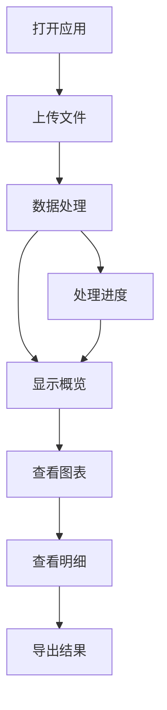

# 财务分析仪表板 - 产品需求文档

## 1. 产品概述

基于现有Python财务分析工具，重构为现代化的Web财务分析仪表板，支持微信支付和支付宝账单数据的上传、解析和可视化分析。

该产品旨在为个人用户提供直观、美观的财务数据分析界面，帮助用户更好地了解自己的收支情况、消费习惯和财务趋势，打造类似后台管理系统的专业级用户体验。

目标是创建一个功能完整、界面现代化的个人财务管理工具，提升用户的财务数据分析效率。

## 2. 核心功能

### 2.1 用户角色

| 角色 | 注册方式 | 核心权限 |
|------|----------|----------|
| 个人用户 | 无需注册，直接使用 | 可上传账单文件、查看分析报告、导出数据 |

### 2.2 功能模块

我们的财务分析仪表板采用单页面应用设计，包含以下主要功能区域：

1. **文件上传区域**：支持拖拽上传微信支付和支付宝账单文件
2. **数据概览卡片**：显示总收入、总支出、净收入等核心指标
3. **图表展示区域**：多维度数据可视化图表展示
4. **详细数据表格**：交易明细表格，支持筛选和排序
5. **导出功能**：支持将分析结果导出为图片或打印

### 2.3 功能区域详情

| 区域名称 | 模块名称 | 功能描述 |
|----------|----------|----------|
| 顶部标题栏 | 应用标题 | 显示"财务分析仪表板"标题和简要说明 |
| 文件上传区 | 拖拽上传 | 支持拖拽上传.xlsx和.csv格式的账单文件，支持多文件同时上传 |
| 文件上传区 | 文件识别 | 自动识别微信支付和支付宝账单文件格式 |
| 文件上传区 | 处理状态 | 显示文件解析和数据清理的进度状态 |
| 数据概览区 | 核心指标卡片 | 显示总收入、总支出、净收入、交易笔数等关键数据 |
| 数据概览区 | 时间范围 | 显示数据的时间跨度和最后更新时间 |
| 图表展示区 | 收支对比图 | 柱状图显示总收入vs总支出对比 |
| 图表展示区 | 趋势分析图 | 折线图显示时间序列的收支变化趋势 |
| 图表展示区 | 分类饼图 | 饼图显示支出品类分布和收入来源分布 |
| 图表展示区 | 支付方式图 | 条形图显示不同支付方式的使用情况 |
| 数据表格区 | 交易明细表 | 显示所有交易记录，支持排序和筛选 |
| 数据表格区 | 搜索功能 | 支持按商户名称、交易类型、金额范围等条件搜索 |
| 数据表格区 | 分页显示 | 大量数据时支持分页浏览，提升页面性能 |

## 3. 核心流程

### 主要用户操作流程：

1. **数据上传和处理流程**：用户打开应用 → 拖拽或选择账单文件到上传区域 → 系统自动识别文件类型 → 解析和清理数据 → 实时显示处理进度 → 完成后自动展示分析结果

2. **数据查看和分析流程**：数据处理完成后 → 查看概览卡片了解基本情况 → 浏览各类图表进行可视化分析 → 查看详细交易表格了解具体明细 → 使用搜索和筛选功能定位特定数据

3. **结果导出流程**：分析完成后 → 使用浏览器打印功能保存为PDF → 或右键保存图表为图片 → 或复制表格数据到Excel

## 4. 用户界面设计

### 4.1 设计风格

- **主色调**：深蓝色 (#1e40af) 和浅蓝色 (#3b82f6)，体现专业和信任感
- **辅助色**：绿色 (#10b981) 表示收入，红色 (#ef4444) 表示支出，灰色 (#6b7280) 用于中性信息
- **按钮样式**：圆角按钮，支持悬停和点击状态，使用阴影效果
- **字体**：Inter字体，标题使用16-24px，正文使用14-16px，小字使用12px
- **布局风格**：卡片式布局，左侧导航栏，顶部面包屑导航
- **图标风格**：使用Lucide React图标库，线性风格，保持一致性

### 4.2 界面设计概览

| 区域名称 | 模块名称 | UI元素 |
|----------|----------|--------|
| 顶部标题栏 | 应用标题 | 大标题文字，副标题说明，简洁的顶部导航 |
| 文件上传区 | 拖拽区域 | 虚线边框卡片，拖拽时高亮效果，文件图标和提示文字 |
| 文件上传区 | 进度指示 | 线性进度条，处理状态文字，成功/错误提示 |
| 数据概览区 | 指标卡片 | 4个并排的Card组件，包含数字、图标、颜色区分 |
| 数据概览区 | 统计信息 | 小字体显示数据时间范围和记录数量 |
| 图表展示区 | 图表网格 | 2x2网格布局，每个图表独立的Card容器 |
| 图表展示区 | 图表组件 | 使用Recharts库，响应式设计，工具提示和图例 |
| 数据表格区 | 搜索栏 | 带搜索图标的输入框，实时搜索功能 |
| 数据表格区 | 数据表格 | 使用Table组件，支持排序、分页、斑马纹样式 |

### 4.3 响应式设计

产品采用响应式设计，主要针对桌面端使用，同时兼容平板和移动端：

- **桌面端 (≥1024px)**：完整布局，4列指标卡片，2x2图表网格，完整数据表格
- **平板端 (768px-1023px)**：2列指标卡片，2x1图表布局，简化表格显示
- **移动端 (<768px)**：单列布局，堆叠式指标卡片，单个图表显示，表格横向滚动