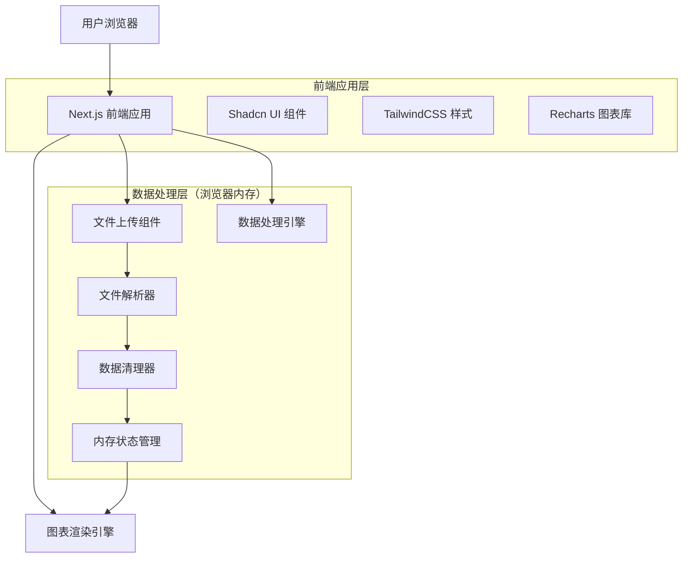
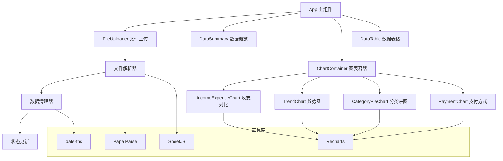

# 财务分析仪表板 - 技术架构文档

## 1. 架构设计



## 2. 技术描述

* **前端框架**：Next.js\@14 + React\@18 + TypeScript

* **样式方案**：TailwindCSS\@3 + Shadcn UI组件库

* **图表库**：Recharts\@2 (基于D3.js的React图表库)

* **文件处理**：Papa Parse (CSV解析) + SheetJS (Excel解析)

* **状态管理**：React useState + useContext (无需外部状态库)

* **构建工具**：Next.js内置构建系统

* **部署方式**：静态导出 (next export) 用于本地离线使用

## 你有必要这个图表库还换一个其他的吗 你所有都用3. 页面结构

本项目采用单页面应用设计，所有功能集成在一个页面中：

| 区域     | 功能                 |
| ------ | ------------------ |
| 顶部导航   | 项目标题和功能切换标签        |
| 文件上传区  | 拖拽上传微信支付和支付宝账单文件   |
| 数据概览卡片 | 显示总收入、总支出、净收入等核心指标 |
| 图表展示区  | 多个图表组件展示数据分析结果     |
| 详细数据表格 | 显示处理后的交易明细数据       |

## 4. 核心功能模块

### 4.1 文件处理模块

**文件上传处理**

```typescript
// 文件上传和解析逻辑
const handleFileUpload = async (file: File, fileType: 'wechat' | 'alipay') => {
  const data = await parseFile(file, fileType);
  const cleanedData = cleanTransactionData(data);
  setTransactions(cleanedData);
  generateSummary(cleanedData);
};
```

**数据清理处理**

```typescript
// 数据清理和标准化
const cleanTransactionData = (rawData: any[]) => {
  return rawData
    .filter(row => row.amount !== 0) // 过滤零金额交易
    .filter(row => !row.description?.includes('不计收支')) // 过滤无效交易
    .map(row => ({
      id: generateId(),
      transactionTime: parseDate(row.time),
      category: row.category || '其他',
      counterparty: row.counterparty,
      description: row.description,
      type: row.amount > 0 ? '收入' : '支出',
      amount: Math.abs(row.amount),
      paymentMethod: row.paymentMethod,
      source: fileType
    }));
};
```

## 5. 前端组件架构



## 6. 数据结构

### 6.1 内存数据模型

项目中所有数据都存储在React组件的状态中，无需持久化存储：

```mermaid
flowchart TD
    A[原始文件数据] --> B[数据解析]
    B --> C[数据清理]
    C --> D[标准化交易数据]
    D --> E[生成统计摘要]
    D --> F[生成图表数据]
    
    subgraph "内存状态"
        G[transactions: TransactionData[]]
        H[summary: DataSummary]
        I[chartData: ChartData[]]
        J[loading: boolean]
        K[error: string | null]
    end
    
    D --> G
    E --> H
    F --> I
```

### 6.2 核心TypeScript类型定义

```typescript
// 交易数据类型
interface TransactionData {
  id: string;
  transactionTime: Date;
  category: string;
  counterparty: string;
  description: string;
  type: '收入' | '支出';
  amount: number;
  paymentMethod: string;
  source: 'wechat' | 'alipay';
}

// 数据摘要类型
interface DataSummary {
  totalIncome: number;
  totalExpense: number;
  netIncome: number;
  transactionCount: number;
  dateRange: {
    start: Date;
    end: Date;
  };
}

// 图表数据类型
interface ChartData {
  type: 'bar' | 'line' | 'pie' | 'area';
  data: Array<{
    name: string;
    value: number;
    [key: string]: any;
  }>;
  config: {
    xAxis?: string;
    yAxis?: string;
    colors?: string[];
  };
}

// 导出选项类型
interface ExportOptions {
  includeCharts: boolean;
  includeTables: boolean;
  dateRange?: {
    start: Date;
    end: Date;
  };
  categories?: string[];
}

// 应用状态类型
interface AppState {
  transactions: TransactionData[];
  summary: DataSummary | null;
  isLoading: boolean;
  error: string | null;
  filters: {
    dateRange?: { start: Date; end: Date };
    categories?: string[];
    amountRange?: { min: number; max: number };
  };
}
```

### 6.3 项目结构

```typescript
// 简化的项目结构
src/
├── components/
│   ├── ui/                 // Shadcn UI基础组件
│   │   ├── button.tsx
│   │   ├── card.tsx
│   │   ├── table.tsx
│   │   └── ...
│   ├── FileUploader.tsx    // 文件上传组件
│   ├── DataSummary.tsx     // 数据概览卡片
│   ├── ChartContainer.tsx  // 图表容器
│   ├── DataTable.tsx       // 数据表格
│   └── charts/             // 具体图表组件
│       ├── IncomeExpenseChart.tsx
│       ├── TrendChart.tsx
│       ├── CategoryPieChart.tsx
│       └── PaymentMethodChart.tsx
├── lib/                    // 工具函数
│   ├── fileParser.ts      // 文件解析逻辑
│   ├── dataProcessor.ts   // 数据处理和清理
│   └── chartUtils.ts      // 图表数据生成
├── types/                  // TypeScript类型定义
│   └── index.ts
├── pages/                  // Next.js页面
│   └── index.tsx          // 单页面应用主页
└── styles/                 // 样式文件
    └── globals.css
```

### 6.4 主要功能实现

```typescript
// 主页面组件示例
export default function HomePage() {
  const [transactions, setTransactions] = useState<TransactionData[]>([]);
  const [summary, setSummary] = useState<DataSummary | null>(null);
  const [loading, setLoading] = useState(false);
  
  const handleFileUpload = async (files: File[]) => {
    setLoading(true);
    try {
      const allTransactions = [];
      for (const file of files) {
        const fileType = detectFileType(file.name);
        const data = await parseFile(file, fileType);
        const cleaned = cleanTransactionData(data, fileType);
        allTransactions.push(...cleaned);
      }
      setTransactions(allTransactions);
      setSummary(generateSummary(allTransactions));
    } catch (error) {
      console.error('文件处理失败:', error);
    } finally {
      setLoading(false);
    }
  };
  
  return (
    <div className="min-h-screen bg-gray-50">
      <div className="container mx-auto p-6">
        <h1 className="text-3xl font-bold mb-8">财务分析仪表板</h1>
        
        <FileUploader onUpload={handleFileUpload} loading={loading} />
        
        {summary && (
          <>
            <DataSummary summary={summary} />
            <ChartContainer transactions={transactions} />
            <DataTable transactions={transactions} />
          </>
        )}
      </div>
    </div>
  );
}
```

